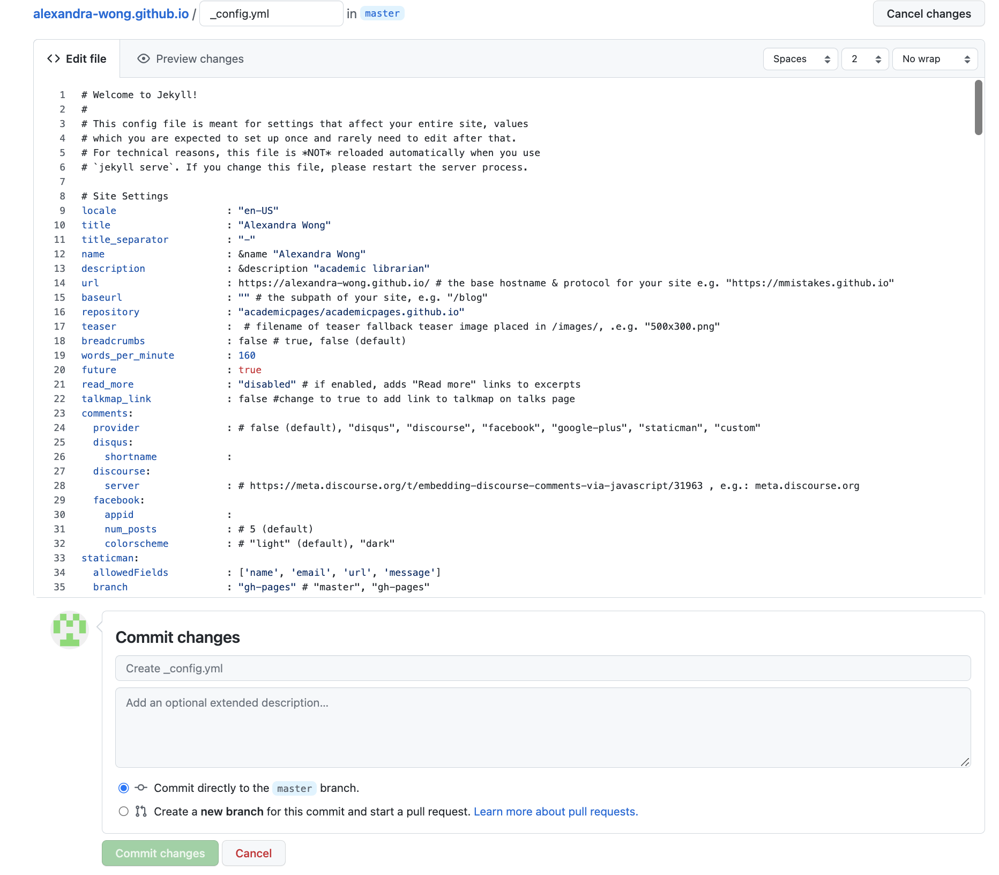

# Creating a personal website with GitHub Pages

## About GitHub Pages
[GitHub Pages](https://docs.github.com/en/pages/getting-started-with-github-pages/about-github-pages) is a free service that allows you to host a website directly from a Github.com repository. It's a static site hosting service that takes HTML, CSS, and Javascript files directly from your Github.com repository and publishes the website.

## Setting up GitHub Pages using the academicpages template
Creating a GitHub Pages site is a straightforward process: Create a repository, make sure your repository name is `<user>.github.io` and then configure your Pages under the Settings tab of that repository. [Full instructions are available here.](https://docs.github.com/en/pages/getting-started-with-github-pages/creating-a-github-pages-site)

However, in this workshop, we don't want to create a GitHub Pages site from scratch. We want to save time and energy by using a template. There are many templates for GitHub Pages available out there, but today we will be using the [academicpages template](https://academicpages.github.io/) since it is meant specifically for personal academic websites! 

### academicpages template
The academicpages template was created by Stuart Geiger and was itself forked and edited from another popular template, Minimal Mistakes Jekyll Theme by Michael Rose. (The power of the internet and code sharing!)

### Forking the academicpages tempate
1. Go to the GitHub repository of the template: https://github.com/academicpages/academicpages.github.io  
  
2. Click the Fork button in the top right corner.
3. Create a new fork by giving your repository the name `<user>.github.io` (ex. alexandra-wong.github.io). 

Note: You could also change the name of your repository, if desired, by going to the Settings > General tab > Rename.   

4. Now you should have a personal webiste which you can see if you go to `<user>.github.io`! 

**Note**: The URL of your personal website has to be your username. You may need to create a new account or change your username if you want it to your name instead of a different GitHub handle. To change your username:
1. Click your profile image in the top right corner > Settings
2. Click account > Change username 
3. Make sure this is what you want! Will other Pages or an old profile page be affected by the change? If not, click `I understand` and choose your new username.

 

## Editing your GitHub Pages repository
Now that we have it said up, we want to change the template information to our own. The main page of https://academicpages.github.io/ gives a good indication of how to get started doing so.

### Editing the `_config.yml` file
The config file controls the information that affects the entire site, like the sidebar content.

To edit, click into your `_config.yml` file, click the pencil button, and start editing.

Important information to change include:
- Title
- Name 
- Description
- URL (change to your own repository so that the Publications/Talks/etc. links in the top menu go to your website!)
- Site author information including name, bio, description, and any other accounts to link to
- Image: Add your image by uploading it into the `images` folder by clicking into `images` > Add file > Upload files > then upload and commit changes
    
    
### Continue editing!
We could continue to edit in GitHub.com directly, but the editing interface could be a little easier to use. Let's switch to editing ourcontent in Visual Studio Code instead.

**For an example of what to change in different parts of the website contents, [see this example showcasing GitHub Diffs.](https://archive.is/3TPas)**
