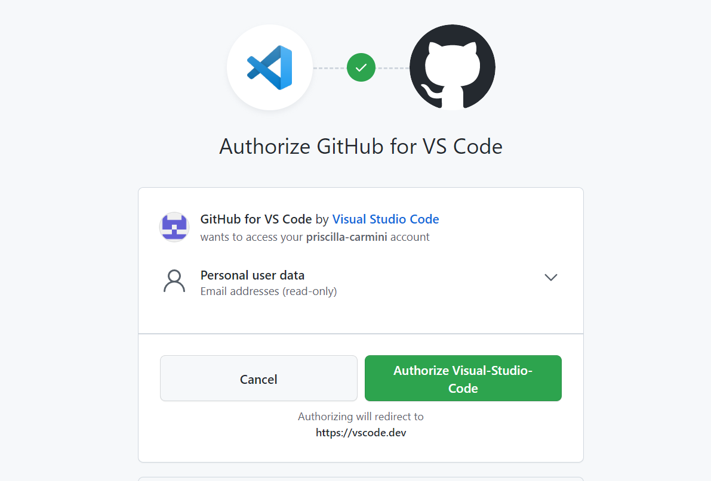
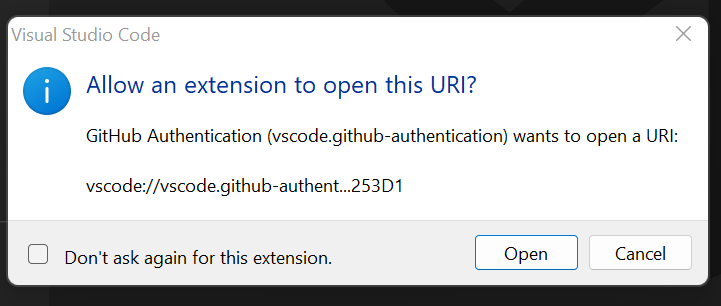
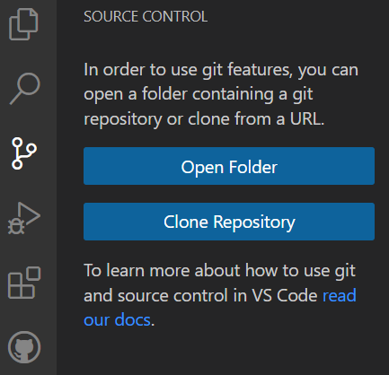
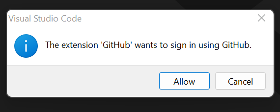
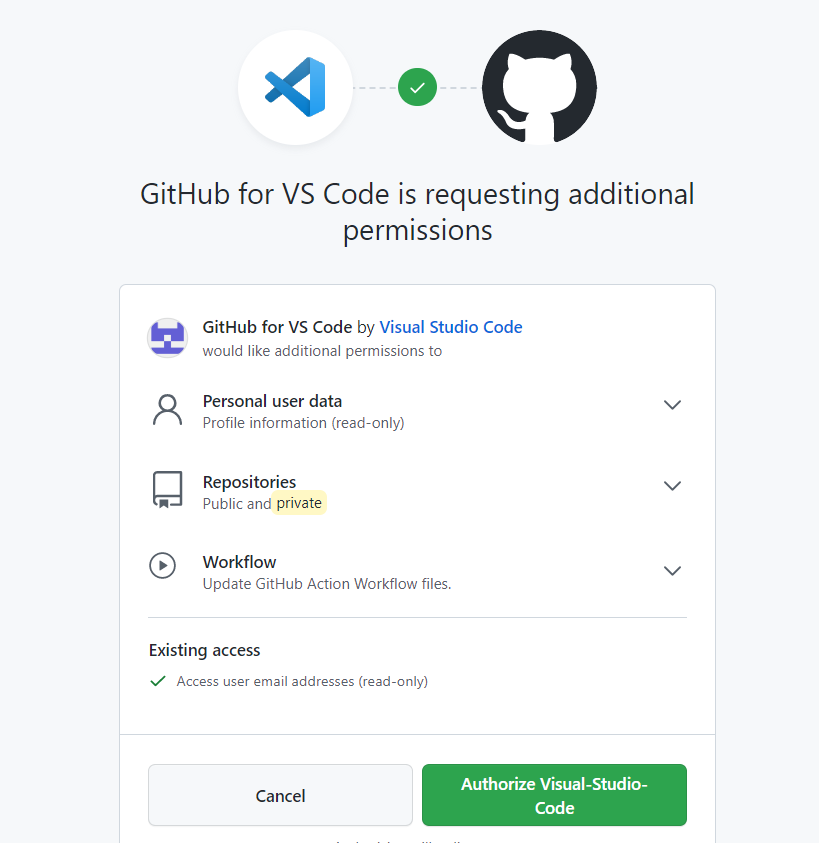

# Editing Your Personal Website in Visual Studio Code

## Connecting Visual Studio Code to Your GitHub Account
1. Start by installing the [GitHub Pull Requests and Issues](https://marketplace.visualstudio.com/items?itemName=GitHub.vscode-pull-request-github) extension.

2. Click on the account icon on the bottom left side of your screen, and select **Sign in & Turn on**. Then select **Sign in with GitHub** to sync your GitHub account to Visual Studio Code. 

3. You will be redirected to a page called **Authorize GitHub for VS Code**. Select the **Authorize Visual-Studio-Code** button. A pop-up window will appear in Visual Studio Code. Select **Open**.

## Clone a Repository
Now you're ready to create a copy of your repository on GitHub to edit on VSC!
1. Start by going to **Source Control** and select **Clone Repository**. Select **Clone from GitHub**.

2. A pop-up will appear asking if you want to sign in using GitHub. Select **Allow**. Then select **Authorize Visual-Studio-Code**. Enter your GitHub password.

3. Select **Open** in the pop-up appearing in VSC. Then search for the repository you wish to clone in the search bar. Select the destination for the repository on your local machine. 

## Editing a Talk page in Markdown

Use this [guide to basic Markdown syntax](https://www.markdownguide.org/basic-syntax/), if desired.

In the above image, we bolded the word Abstract with two astericks on either side of the word. 
We also created a hyperlink to the presentation using the common syntax of the visible text in square brackets with the URL following it in rounded brackets.

## Commiting changes in VSC

There are 3 options for commiting:
1. **Commit**: Saves changes to your local machine
2. **Commit & Push**: Saves chagnes to your local machine and pushes to your remote repository.
3. **Commit & Sync**: Saves changes to your local machine, pulls from your remote repository, and then pushes to your remote repository.

After committing, sync changes and a helpful dialog pops up. Click OK.

If this is the first time syncing, it will probably ask you to sign into your GitHub account. Provide your GitHub password and click Open to Allow the extension.

### Let's check if it updated properly on GitHub and on my GitHub Pages website!

Sure enough, it has updated on both.
